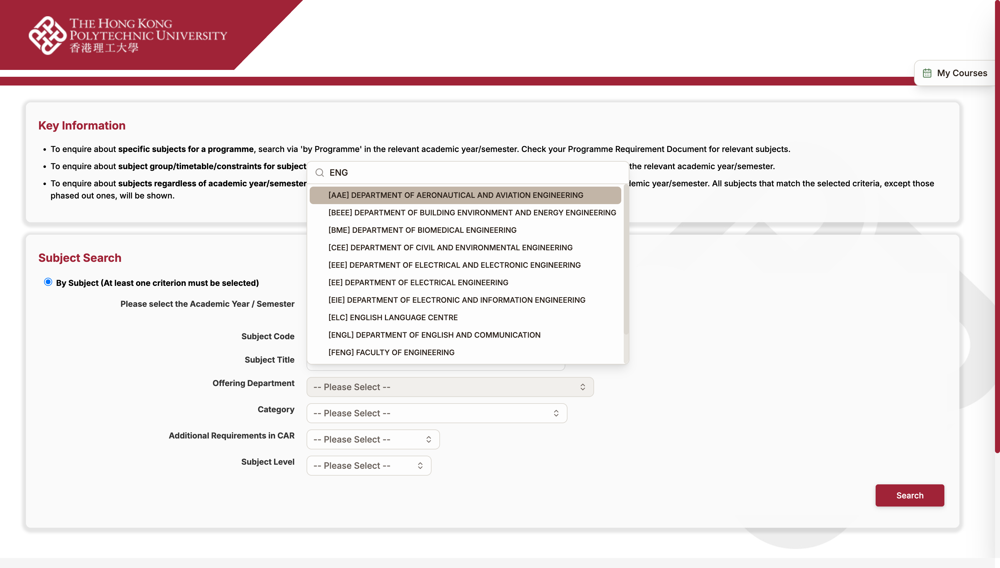
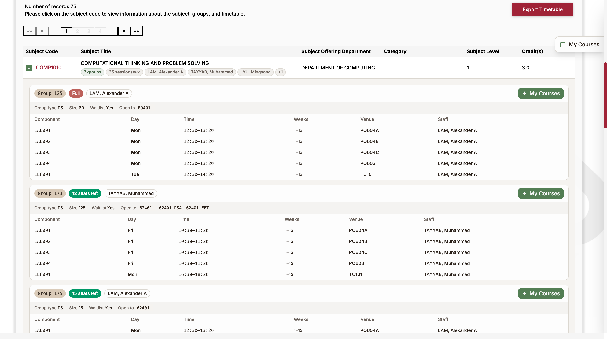
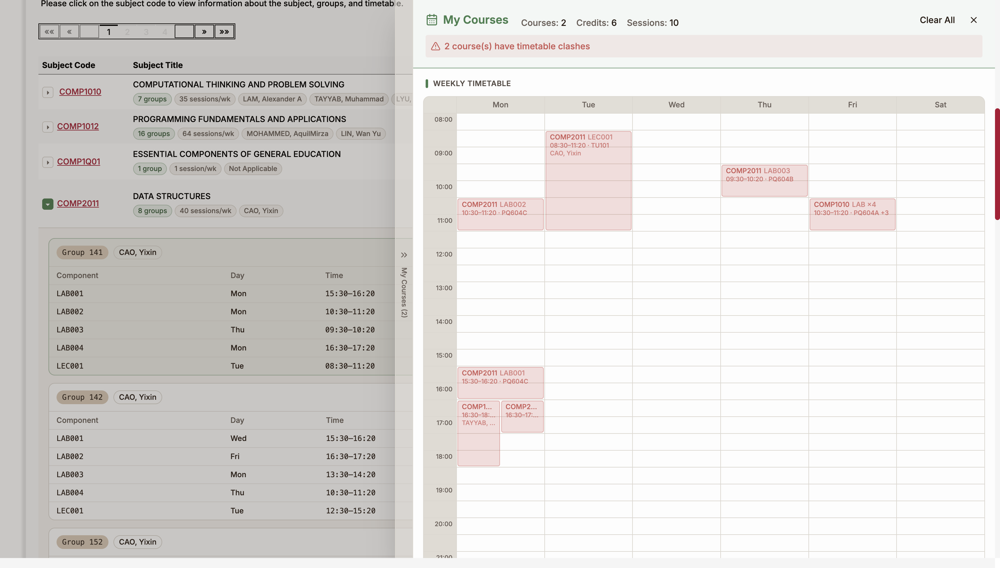
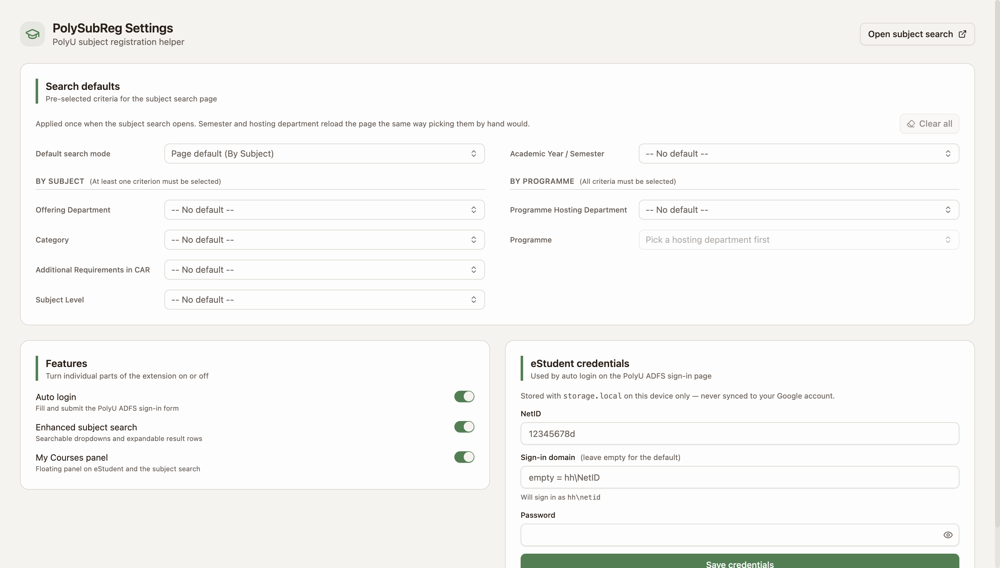

# PSR — PolySubReg

A Chrome extension (Manifest V3) that makes PolyU subject registration bearable:
auto sign-in, a subject search that is actually searchable, and a My Courses
panel with clash detection.

## Features

### 1. Auto login

Fills and submits the PolyU ADFS sign-in form
(`adfs.polyu.edu.hk/adfs/ls/`) so `eStudent` opens without retyping your NetID.

Credentials are stored with `chrome.storage.local` — on this device only, never
through `storage.sync`, which would push the password into your Google account.
Auto-submit backs off as soon as ADFS reports an error, so a wrong password
cannot burn attempts in a loop, and any MFA step is left to you.

### 2. Enhanced subject search

Applies to both the anonymous and the signed-in search pages:

- `https://www38.polyu.edu.hk/ePublic/subject-search.jsf`
- `https://www38.polyu.edu.hk/eStudent/secure/information/subject-search.jsf`

**Searchable dropdowns.** Every criteria `<select>` is replaced with a combobox
that filters as you type — the Offering Department list alone has 70 entries.
The native `<select>` stays in the form and keeps its value, so JSF's own
submit and auto-submit behaviour is untouched.

**Detail without navigation.** The site makes you open a subject's own page to
see who teaches it and when. PSR instead calls the page's own *Export Timetable*
endpoint once per search — a single request that returns every group, component,
slot, venue and lecturer for *all* matching subjects across *all* result pages —
and uses it to:

- annotate each result row inline with its group count, weekly session count
  and lecturers;
- render a full per-group timetable under a ▸ toggle to the left of the subject
  code, with a button to add that group to My Courses.

**Vacancies and eligibility, per group.** Expanding a row also pulls that
subject's *Subject Group Details* — how many seats are left (or how long the
waitlist is), the group's type and size, and the programme codes it is open to
— and folds them into the matching group card. That table lives on
`subject-search-details.jsf`, which has no addressable URL: it renders whichever
subject the session last picked, so it is requested by replaying the postback
the subject-code link submits. The open results page is left as it was.

### 3. My Courses panel

A floating launcher on every `eStudent` page opens a side panel showing the
groups you have picked, as a weekly grid or a list, with:

- credits and session totals,
- timetable clash detection (day, time *and* teaching-week overlap),
- import of your registered subjects from whichever eStudent page you are on.

The visual design follows the [`seper`](../seper) project's Morandi palette.

## Screenshots

Captured live against `ePublic` with the built extension loaded.

**Searchable dropdowns** — type to filter the 70-entry department list; the
native `<select>` stays in the form underneath:



**Detail without navigation** — every result row is annotated inline with its
group count, weekly sessions and lecturers; ▾ expands the full per-group
timetable, each group headed by its seats left and the programmes it is open
to, with an add-to-My-Courses button:



**My Courses panel** — full-day weekly grid plus a compact course list, with
timetable clash detection (both picks here collide, hence the red):



**Settings page** — search defaults split by search mode (By Subject left,
By Programme right, with the live programme list per department), feature
toggles and credentials:



## Development

```bash
pnpm install
pnpm dev        # watch + rebuild -> build/chrome-mv3-dev
pnpm build      # production build -> build/chrome-mv3
pnpm test       # parser + timetable unit tests
pnpm compile    # typecheck
```

Then load the build into your own Chrome:

1. `chrome://extensions` → enable **Developer mode**
2. **Load unpacked** → pick `build/chrome-mv3-dev` (or `build/chrome-mv3`)
3. Open the extension popup and save your NetID and password

`wxt dev` deliberately does not spawn its own browser (`webExt.disabled`): the
one it launches carries automation flags that make Chrome show an "unsupported
command-line flag" banner, and it starts from an empty profile on every run. Use
your own Chrome and keep the dev server running — it rebuilds and reloads the
loaded extension on save.

The output directory is `build/` rather than WXT's default `.output/`, which
macOS hides from the file picker. (`dist/` is not usable here — it collides with
Vite's own default and breaks entry file name resolution.)

> Chrome 137+ ignores the `--load-extension` command-line switch. Loading
> unpacked from the `chrome://extensions` UI is unaffected, but scripted runs
> have to go through the CDP `Extensions.loadUnpacked` method with
> `--enable-unsafe-extension-debugging`.

### Layout

```
entrypoints/
  auto-login.content.ts       ADFS sign-in form
  subject-search.content/     searchable dropdowns + expandable result rows
  my-courses.content/         floating launcher and panel
  popup/                      credentials and feature toggles
lib/polyu/
  parse.ts                    result table, timetable export, group details
  details.ts                  replays the subject-code postback for vacancies
  timetable.ts                time maths, clash detection, weekly grid layout
  harvest.ts                  scrapes registered subjects off eStudent pages
tests/fixtures/               verbatim slices of live PolyU responses
```

### Notes on the PolyU markup

The pages are JSF + RichFaces, which drives a few decisions:

- Element ids (`j_id19`, `mainForm:searchTable:0:j_id111`) are generated and
  shift between deployments, so every parser keys off **header text** instead.
- JSF inlines a `<script>` block into the first result cell and a `<style>`
  block into the category cell, so cell text has to be read with script and
  style subtrees skipped — plain `textContent` returns JavaScript source.
- One timetable row can name **several groups at once** (`1015, 125, 175`) when
  they share a class; each code gets its own copy of the session.
- Paging the results is a RichFaces AJAX partial update that replaces the table,
  so the content script re-applies itself on mutation.

## Licence

MIT
